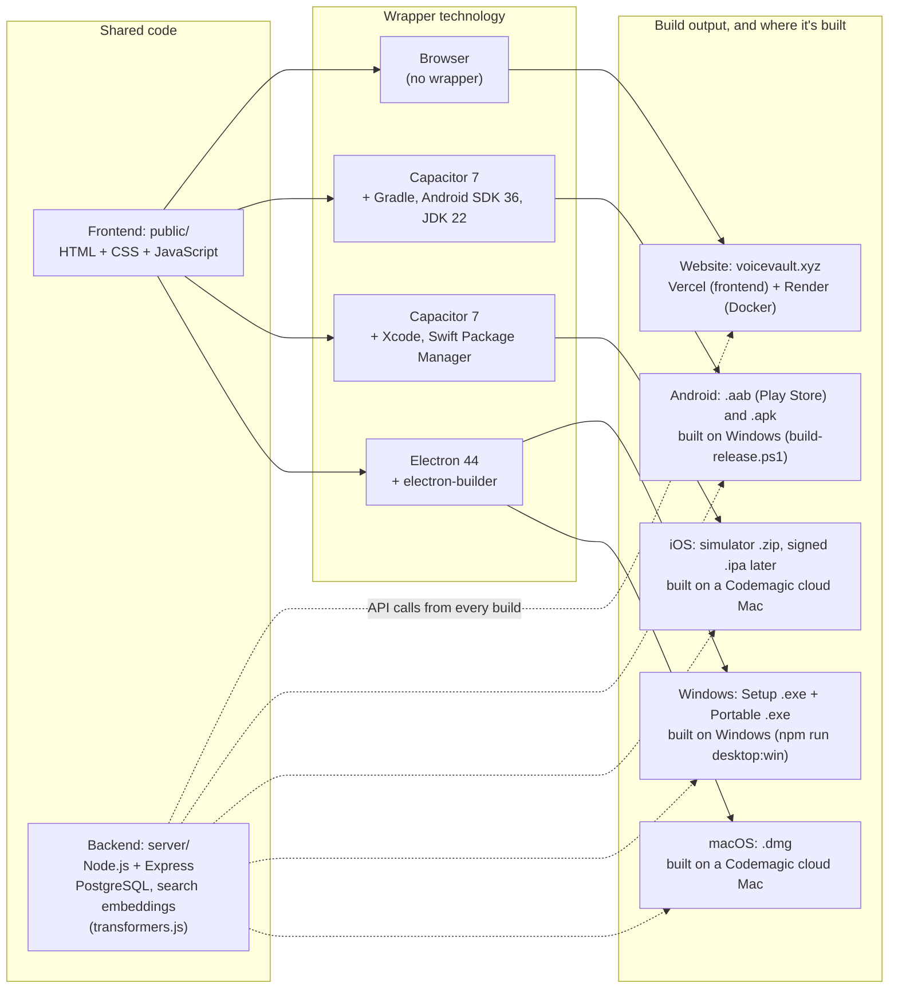

## 2026-05-07 (UI refresh)

- **Header status**
  - “Ready” pill now shows **“Displaying Saved Notes…”** while the saved-notes list is loading/rendering; styled as a neutral pill (no blue tint).
  - Added lightweight timing breadcrumbs in the console to separate **fetch** vs **render** time for saved notes.

- **Icons + buttons**
  - Updated **Save** icon to a clearer floppy shape; **Stop** symbol is larger without changing button hit area.
  - Reverted **Reprocess** and **Retry all errors** to **text buttons** where requested; “Apply” in Processes is a **tick icon**.
  - Replaced Play/Expand/Collapse text controls with icon buttons in the saved-notes UI; collapse uses a left-arrow icon.

- **Saved notes: collapsed/expanded UX**
  - Added a **star** control and **pinned starred notes to the top** of the saved-notes list.
  - Collapsed saved-card shows a **star icon** overlay; expanded header also shows the star near the collapse control.
  - Expanded transcript: title is **sticky** while scrolling.
  - Segment playback:
    - Segment play uses a **distinct icon** from full-audio play.
    - Clicking a segment toggles **Play ↔ Stop**, and the active segment row is **highlighted** during playback (works with or without word timing).
    - Full-audio playback also highlights the active segment row while following along.

- **Expanded playback row**
  - Removed the **Playback speed** control.
  - Inline audio player was relocated into the playback row and made responsive; on narrow widths the player cluster drops below.
  - **Download audio** is an icon button colocated with the inline player.
  - **Loop segment** is hidden until audio is playing, and appears after Download audio.

- **Processes panel**
  - Fixed “jobs not displayed” in Processes by preventing early-returns when summary fetch fails; the jobs list fetch still runs and errors are surfaced.

- **Dev quality of life**
  - Added workspace `.vscode/settings.json` to enable **editor line numbers**.

## Technology and build map (2026-10-01)

The voiceVault website and the NoteVault apps share one frontend (`public/`) and one backend (`api.voicevault.xyz`). Each build wraps the same frontend with a different technology. The app wrappers (Capacitor, Electron) live in the NoteVault project (`D:\Projects\NoteVault`, GitHub `1218Anubhavmishra/NoteVault`).

