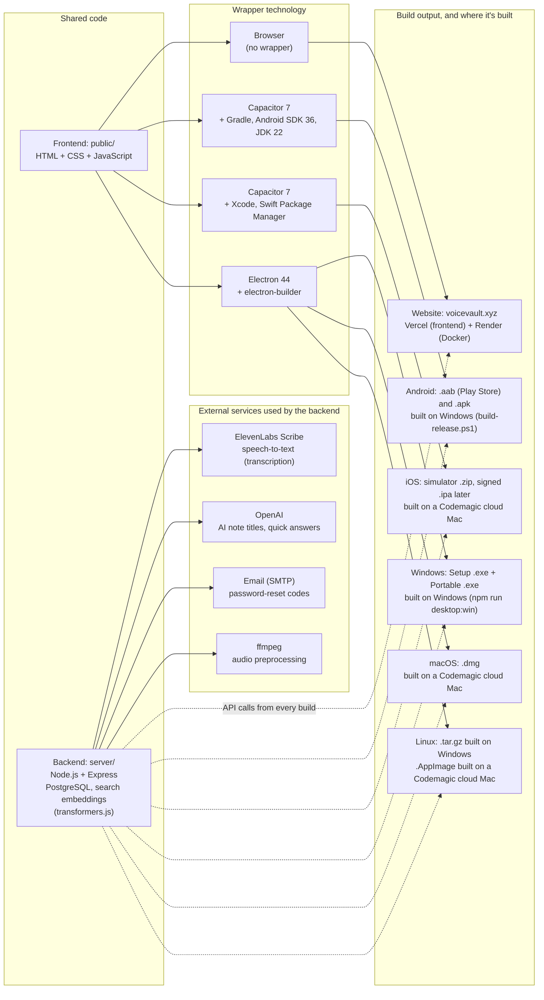

## 2026-09-28 to 2026-10-01 (backend support for the NoteVault apps, faster search, iOS)

- **App sessions**: `VOICEVAULT_CROSS_SITE_COOKIES=1` makes the session cookie SameSite=None + Secure so the Android/iOS/desktop apps stay logged in; credentialed CORS is limited to an allowlist (own domains, `https://localhost` for Android/desktop, `capacitor://localhost` and `capacitor://app.voicevault.xyz` for iOS, local dev, plus `VOICEVAULT_CORS_ORIGINS`).
- **Faster first search**: the embedding model is warmed up when the server starts, baked into the Docker image (`VOICEVAULT_MODEL_CACHE_DIR`), and note chunks are embedded right after transcription, before the note is marked ready.
- **iOS / phones**: form fields use 16px text on touch screens so iOS doesn't zoom in on focus (which made the login card look oversized and cut off).
- **Empty library message**: fixed invisible text; the box has a light background with dark text again.
- **Docs**: reports now include a technology and build map (frontend, backend, external services, and every build target).

## 2026-05-07 (UI refresh)

- **Header status**
  - “Ready” pill now shows **“Displaying Saved Notes…”** while the saved-notes list is loading/rendering; styled as a neutral pill (no blue tint).
  - Added lightweight timing breadcrumbs in the console to separate **fetch** vs **render** time for saved notes.

- **Icons + buttons**
  - Updated **Save** icon to a clearer floppy shape; **Stop** symbol is larger without changing button hit area.
  - Reverted **Reprocess** and **Retry all errors** to **text buttons** where requested; “Apply” in Processes is a **tick icon**.
  - Replaced Play/Expand/Collapse text controls with icon buttons in the saved-notes UI; collapse uses a left-arrow icon.

- **Saved notes: collapsed/expanded UX**
  - Added a **star** control and **pinned starred notes to the top** of the saved-notes list.
  - Collapsed saved-card shows a **star icon** overlay; expanded header also shows the star near the collapse control.
  - Expanded transcript: title is **sticky** while scrolling.
  - Segment playback:
    - Segment play uses a **distinct icon** from full-audio play.
    - Clicking a segment toggles **Play ↔ Stop**, and the active segment row is **highlighted** during playback (works with or without word timing).
    - Full-audio playback also highlights the active segment row while following along.

- **Expanded playback row**
  - Removed the **Playback speed** control.
  - Inline audio player was relocated into the playback row and made responsive; on narrow widths the player cluster drops below.
  - **Download audio** is an icon button colocated with the inline player.
  - **Loop segment** is hidden until audio is playing, and appears after Download audio.

- **Processes panel**
  - Fixed “jobs not displayed” in Processes by preventing early-returns when summary fetch fails; the jobs list fetch still runs and errors are surfaced.

- **Dev quality of life**
  - Added workspace `.vscode/settings.json` to enable **editor line numbers**.

## Technology and build map (2026-10-01)

The voiceVault website and the NoteVault apps share one frontend (`public/`) and one backend (`api.voicevault.xyz`). Each build wraps the same frontend with a different technology. The app wrappers (Capacitor, Electron) live in the NoteVault project (`D:\Projects\NoteVault`, GitHub `1218Anubhavmishra/NoteVault`). The backend calls **ElevenLabs Scribe** to turn recorded audio into text (word timestamps and language detection; `server/elevenlabs-stt-vv.js`, key `ELEVENLABS_API_KEY`). A local faster-whisper model is an optional alternative (`VOICEVAULT_STT_PROVIDER=whisper`). OpenAI generates note titles and quick answers when `OPENAI_API_KEY` is set, SMTP email sends password-reset codes, and ffmpeg prepares audio before transcription. Search embeddings run locally on the server (transformers.js), so search needs no external API.

