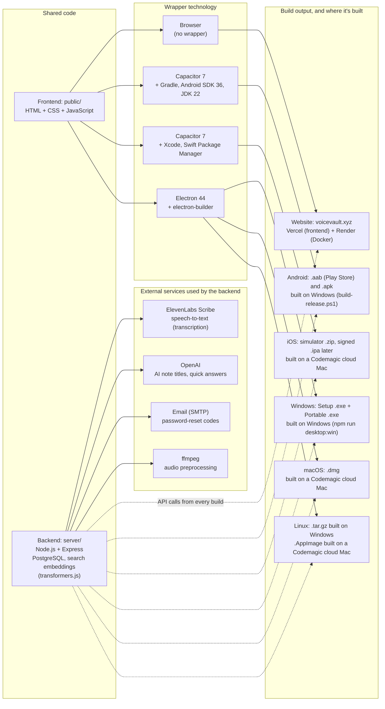

## Session summary

- **App sessions + CORS**: cross-site session cookies behind `VOICEVAULT_CROSS_SITE_COOKIES=1`; CORS allowlist covers the Android/desktop (`https://localhost`) and iOS (`capacitor://localhost`, `capacitor://app.voicevault.xyz`) app origins.
- **Faster first search**: embedder warm-up at server start, model baked into the Docker image, chunks embedded at transcription time. Confirmed fast for new and old notes.
- **iOS zoom fix**: 16px form fields on touch screens (iOS zoomed in on focus and never zoomed out).
- **Empty library message**: visible again (light background, dark text).
- **iOS login verified** on a Codemagic iPhone simulator over VNC after the `app.voicevault.xyz` origin change.
- **Reports**: technology and build map added (with ElevenLabs, OpenAI, email and ffmpeg as backend services); README brought up to date (PostgreSQL, ElevenLabs, live URLs, NoteVault apps).
- Earlier session (2026-05-07, UI refresh) is recorded in `Edits_made.md`.

## Technology and build map (2026-10-01)

The voiceVault website and the NoteVault apps share one frontend (`public/`) and one backend (`api.voicevault.xyz`). Each build wraps the same frontend with a different technology. The app wrappers (Capacitor, Electron) live in the NoteVault project (`D:\Projects\NoteVault`, GitHub `1218Anubhavmishra/NoteVault`). The backend calls **ElevenLabs Scribe** to turn recorded audio into text (word timestamps and language detection; `server/elevenlabs-stt-vv.js`, key `ELEVENLABS_API_KEY`). A local faster-whisper model is an optional alternative (`VOICEVAULT_STT_PROVIDER=whisper`). OpenAI generates note titles and quick answers when `OPENAI_API_KEY` is set, SMTP email sends password-reset codes, and ffmpeg prepares audio before transcription. Search embeddings run locally on the server (transformers.js), so search needs no external API.

