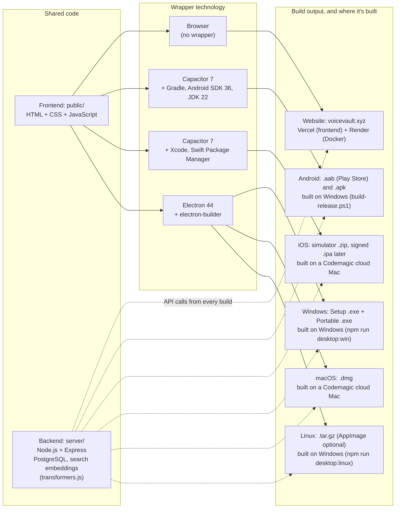

## Session summary

- **Saved notes UX overhaul**: icon-based header actions, sticky title while scrolling, segment play/stop with row highlight, full-audio play and segment play use different icons.
- **Star + pinning**: starred notes pin to the top; star is visible in collapsed + expanded states.
- **Processes**: jobs list loads even when summary is unavailable; errors are shown in the panel.
- **Header status**: “Displaying Saved Notes…” is shown until notes render; neutral pill styling; console timing breadcrumb logs fetch vs render time.
- **Playback row**: removed Playback speed; inline audio (fixed width) + download icon; Loop is hidden until audio plays and appears after download; responsive wrap under narrow widths.

## Technology and build map (2026-10-01)

The voiceVault website and the NoteVault apps share one frontend (`public/`) and one backend (`api.voicevault.xyz`). Each build wraps the same frontend with a different technology. The app wrappers (Capacitor, Electron) live in the NoteVault project (`D:\Projects\NoteVault`, GitHub `1218Anubhavmishra/NoteVault`).

