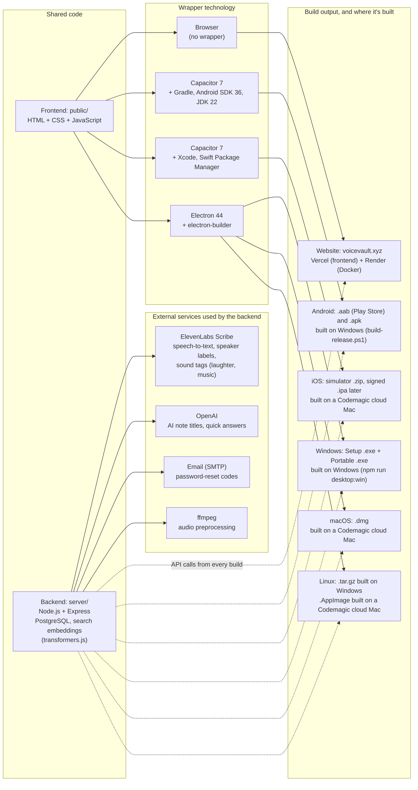

## 2026-10-02: speaker labels, sound tags, account deletion, MP4 fallback

- **Speaker labels**: note transcription now asks ElevenLabs Scribe to tell speakers apart (`diarize`). Each line of the transcript starts with "Speaker 1:", "Speaker 2:" and so on, and each saved segment remembers its speaker (`segments_json` and the new `note_segments.speaker` column). Search queries and the live preview are not labelled.
- **Renaming speakers**: after "Full preview" a "Speakers" box lists each speaker with an editable name (for example "Speaker 1" to "David"); the transcript updates as you type. Saved notes have the same box in Edit mode, and the server renames the speaker everywhere in the note (`PATCH /api/notes/:id` with `speakers`). Names are limited to letters, digits, spaces, `'` and `-` (40 characters).
- **Titles**: automatic titles (AI or heuristic) are made from the transcript without speaker labels and sound tags, then list every detected speaker, for example "Project Deadline Plan — Speaker 1, Speaker 2". Renaming a speaker also renames it in the title, wherever the name appears (including older titles that start with "Speaker 1").
- **Sound tags**: Scribe also adds tags such as "(laughter)" or "(music)" to note transcripts (`tag_audio_events`). It doesn't name specific instruments.
- **Account deletion**: Profile has a "Delete account" section. After the password is confirmed, `POST /api/auth/delete-account` removes the account, all notes, drafts, folders, tags, saved searches, audio files and the profile picture, then signs out. Sessions on other devices stop working (the server checks the account still exists).
- **MP4 recording fallback**: browsers that can't record WebM/Opus (older iPhones and Safari) record MP4 (AAC) instead. The upload is named `.m4a`, and the server and audio download use the right extension.
- **Tested** on a local server: a two-voice recording came back as Speaker 1 and Speaker 2, a rename was saved, a wrong password was refused, and deleting the account removed all its data and ended its session.

## Session summary (2026-09-28 to 2026-10-01)

- **App sessions + CORS**: cross-site session cookies behind `VOICEVAULT_CROSS_SITE_COOKIES=1`; CORS allowlist covers the Android/desktop (`https://localhost`) and iOS (`capacitor://localhost`, `capacitor://app.voicevault.xyz`) app origins.
- **Faster first search**: embedder warm-up at server start, model baked into the Docker image, chunks embedded at transcription time. Confirmed fast for new and old notes.
- **iOS zoom fix**: 16px form fields on touch screens (iOS zoomed in on focus and never zoomed out).
- **Empty library message**: visible again (light background, dark text).
- **iOS login verified** on a Codemagic iPhone simulator over VNC after the `app.voicevault.xyz` origin change.
- **Reports**: technology and build map added (with ElevenLabs, OpenAI, email and ffmpeg as backend services); README brought up to date (PostgreSQL, ElevenLabs, live URLs, NoteVault apps).
- Earlier session (2026-05-07, UI refresh) is recorded in `Edits_made.md`.

## Technology and build map (2026-10-01)

The voiceVault website and the NoteVault apps share one frontend (`public/`) and one backend (`api.voicevault.xyz`). Each build wraps the same frontend with a different technology. The app wrappers (Capacitor, Electron) live in the NoteVault project (`D:\Projects\NoteVault`, GitHub `1218Anubhavmishra/NoteVault`). The backend calls **ElevenLabs Scribe** to turn recorded audio into text (word timestamps, language detection, who spoke each line, and sound tags such as laughter or music; `server/elevenlabs-stt-vv.js`, key `ELEVENLABS_API_KEY`). A local faster-whisper model is an optional alternative (`VOICEVAULT_STT_PROVIDER=whisper`). OpenAI generates note titles and quick answers when `OPENAI_API_KEY` is set, SMTP email sends password-reset codes, and ffmpeg prepares audio before transcription. Search embeddings run locally on the server (transformers.js), so search needs no external API.

