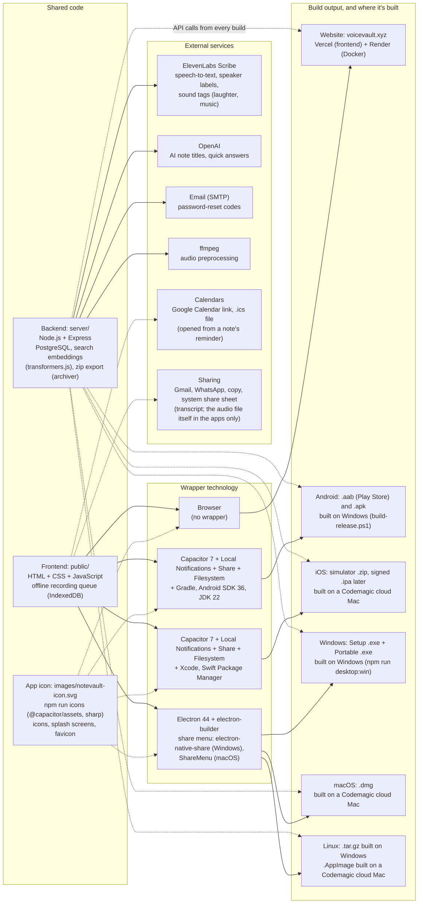

## 2026-10-07 (share a note, app icon)

- **Client only**: `data-share` buttons open `#shareOverlay` (modes Transcript / Audio / Both). Copy uses the Clipboard API (textarea fallback); Gmail opens `mail.google.com/mail/?view=cm`; WhatsApp opens `wa.me/?text=`; messages in those links are capped at 1800 characters.
- **Audio file**: picking Audio or Both fetches `/api/notes/:id/audio` once (`prepareShareAudio`) and names it after the note title (extension from the MIME type). In the Capacitor apps it is written to the cache folder with `@capacitor/filesystem` and shared with `@capacitor/share` (`files: [uri]`; Android's FileProvider already covers `cache-path`). In the NoteVault desktop app the bytes go to `window.vvDesktop.share` (`electron/preload.cjs`); the main process writes the file to a temp folder and opens the Windows share sheet (`electron-native-share`, WinRT `DataTransferManager`) or the macOS `ShareMenu`. In browsers it becomes a `File` for `navigator.share` when `navigator.canShare({files})` allows it. It is prepared before the click because share sheets need a fresh tap. Gmail/WhatsApp open the share sheet with the file when possible; otherwise they download the file (`vvDownloadBlob`) and open the compose link. Download saves the file (hidden in the phone apps, where the share sheet has "Save").
- **Website: transcript only**: `vvCanShareAudio()` is true only in the Capacitor apps or when `window.vvDesktop` exists (Electron). Otherwise the dialog hides the Transcript/Audio/Both row and the audio is never fetched.
- **Removed**: the first version's public links (`note_shares` table, `/api/notes/:id/share`, `/api/share/:token` page and audio route, the auth exemption). `db.js` drops `note_shares` on start.
- **App icon**: `images/notevault-icon.svg` (full icon, white) and `images/notevault-icon-logo.svg` (artwork only). NoteVault's `npm run icons` (`scripts/build-icons.cjs`, `sharp` + `@capacitor/assets`) writes `public/favicon.svg`, `public/icons/icon-{32,192,512}.png`, `public/apple-touch-icon.png`, `build/icon.png` (electron-builder) and every Android/iOS icon and splash; the artwork gets a 12% margin so iOS corners and Android masks don't clip it. `index.html` links the favicon and apple-touch icon; the Electron window uses `icon-512.png`.

## 2026-10-02, later (login limit, offline recording, reminders, export, search fix, tidy-up)

- **Login limit**: an in-memory counter per key (`login:email`, `otp:email`, `delete:user`) allows 3 failures, then blocks for 30 s (HTTP 429 `too_many_attempts`, `retry_after`, `Retry-After` header). When the block ends a new round of 3 starts; counts expire after 15 minutes. Failed responses include `attempts_left`. The login form, the reset-password form and the delete-account panel show the attempts left, then a live countdown (shared `vvStartLockCountdown`, added to the last two on 2026-10-04).
- **Offline recording**: when the browser is offline (or the upload fails with a network error), Save stores the audio and note details in IndexedDB (`voicevault-offline`). `flushOfflineQueue` uploads them through `POST /api/notes` on the `online` event, every 60 s and at login; failed items stay queued. The last session user is cached so the app can open offline.
- **Reminders**: new column `notes.reminder_at` (UTC ISO, empty = none), accepted by `POST`/`PATCH /api/notes` and returned in note lists; `GET /api/reminders` lists upcoming ones. The client builds a Google Calendar link and an `.ics` file (with a `VALARM`), and in the Capacitor apps schedules local notifications (`@capacitor/local-notifications`, ids derived from note ids, stale ones cancelled).
- **Export**: `GET /api/export/notes.zip` streams a zip (`archiver`) with `<title>.txt` and `<title>.<audio ext>` per note; file names are cleaned for Windows, and duplicates get "(2)". Profile has an "Export all notes" button.
- **Search highlight**: `applySearchHitsByTime` used to trim each end of the matched segment's time window, which dropped edge words like "eyes". It now highlights the searched words (stopwords and date words removed, prefix match for 3+ letters), falling back to the segment.
- **Newest label**: the note with the latest `created_at` gets a `.noteNewestBadge`, right-aligned on its own line at the bottom of the card (moved below the action buttons on 2026-10-03 so it doesn't cover them).
- **Job titles**: `suggestNoteTitle` also takes speaker names from line-start labels in the transcript when segments have none.
- **Tidy-up**: blueprint renamed to `VoiceVault_blueprint.md` / `.docx`; documents in `docs/`, images in `images/`; `scripts/build-docs.cjs` reads from `docs/`. Error text colour fixed.

## 2026-10-02 (speaker labels, sound tags, account deletion, MP4 fallback)

- **Speaker labels**: note transcription (Full preview with `purpose=note`, and the background job) sends `diarize=true` and `tag_audio_events=true` to ElevenLabs Scribe. Words carry a `speaker_id`, mapped to "Speaker 1", "Speaker 2" in order of appearance; a new segment starts when the speaker changes, and the transcript is written as "Speaker N: …" lines. Search and live previews are unchanged.
- **Storage**: each segment keeps a `speaker` (in `notes.segments_json` and the new `note_segments.speaker` column, added by a migration on start).
- **Renaming**: a "Speakers" box (after Full preview, and in Edit mode on saved notes) renames a speaker in the text and segments. Saved notes send `speakers: {old: new}` with `PATCH /api/notes/:id`; all renames are applied together, so swapping two names works. Saved transcripts show the speaker name in bold where it changes.
- **Sound tags**: tags like "(laughter)" and "(music)" appear in note transcripts.
- **Titles**: `suggestNoteTitle` removes speaker labels and sound tags before the AI or heuristic title is made, then appends the speakers ("Topic - Speaker 1, Speaker 2"). Used by `/api/transcribe` and when a job finishes. Speaker renames in the app also update the title.
- **Account deletion**: `POST /api/auth/delete-account` with the password deletes the user and every row that belongs to them (notes, segments, chunks, tags, folders, drafts, saved searches, jobs, password resets) in one transaction, then removes audio files and the profile picture and clears the session. `requireUser` now checks the account still exists (cached for 5 minutes), so other devices are signed out. Profile has a "Delete account" section with a password field.
- **MP4 fallback**: `MediaRecorder` tries WebM/Opus first, then MP4/AAC; MP4 recordings are uploaded and downloaded as `.m4a`, and the server maps mp4/m4a/aac to `m4a`.

## 2026-09-28 to 2026-10-01 (backend support for the NoteVault apps, faster search, iOS)

- **App sessions**: `VOICEVAULT_CROSS_SITE_COOKIES=1` makes the session cookie SameSite=None + Secure so the Android/iOS/desktop apps stay logged in; credentialed CORS is limited to an allowlist (own domains, `https://localhost` for Android/desktop, `capacitor://localhost` and `capacitor://app.voicevault.xyz` for iOS, local dev, plus `VOICEVAULT_CORS_ORIGINS`).
- **Faster first search**: the embedding model is warmed up when the server starts, baked into the Docker image (`VOICEVAULT_MODEL_CACHE_DIR`), and note chunks are embedded right after transcription, before the note is marked ready.
- **iOS / phones**: form fields use 16px text on touch screens so iOS doesn't zoom in on focus (which made the login card look oversized and cut off).
- **Empty library message**: fixed invisible text; the box has a light background with dark text again.
- **Docs**: reports now include a technology and build map (frontend, backend, external services, and every build target).

## 2026-05-07 (UI refresh)

- **Header status**
  - “Ready” pill now shows **“Displaying Saved Notes…”** while the saved-notes list is loading/rendering; styled as a neutral pill (no blue tint).
  - Added lightweight timing breadcrumbs in the console to separate **fetch** vs **render** time for saved notes.

- **Icons + buttons**
  - Updated **Save** icon to a clearer floppy shape; **Stop** symbol is larger without changing button hit area.
  - Reverted **Reprocess** and **Retry all errors** to **text buttons** where requested; “Apply” in Processes is a **tick icon**.
  - Replaced Play/Expand/Collapse text controls with icon buttons in the saved-notes UI; collapse uses a left-arrow icon.

- **Saved notes: collapsed/expanded UX**
  - Added a **star** control and **pinned starred notes to the top** of the saved-notes list.
  - Collapsed saved-card shows a **star icon** overlay; expanded header also shows the star near the collapse control.
  - Expanded transcript: title is **sticky** while scrolling.
  - Segment playback:
    - Segment play uses a **distinct icon** from full-audio play.
    - Clicking a segment toggles **Play ↔ Stop**, and the active segment row is **highlighted** during playback (works with or without word timing).
    - Full-audio playback also highlights the active segment row while following along.

- **Expanded playback row**
  - Removed the **Playback speed** control.
  - Inline audio player was relocated into the playback row and made responsive; on narrow widths the player cluster drops below.
  - **Download audio** is an icon button colocated with the inline player.
  - **Loop segment** is hidden until audio is playing, and appears after Download audio.

- **Processes panel**
  - Fixed “jobs not displayed” in Processes by preventing early-returns when summary fetch fails; the jobs list fetch still runs and errors are surfaced.

- **Dev quality of life**
  - Added workspace `.vscode/settings.json` to enable **editor line numbers**.

## Technology and build map (2026-10-01)

The voiceVault website and the NoteVault apps share one frontend (`public/`) and one backend (`api.voicevault.xyz`). Each build wraps the same frontend with a different technology. The app wrappers (Capacitor, Electron) live in the NoteVault project (`D:\Projects\NoteVault`, GitHub `1218Anubhavmishra/NoteVault`). The backend calls **ElevenLabs Scribe** to turn recorded audio into text (word timestamps, language detection, who spoke each line, and sound tags such as laughter or music; `server/elevenlabs-stt-vv.js`, key `ELEVENLABS_API_KEY`). A local faster-whisper model is an optional alternative (`VOICEVAULT_STT_PROVIDER=whisper`). OpenAI generates note titles and quick answers when `OPENAI_API_KEY` is set, SMTP email sends password-reset codes, and ffmpeg prepares audio before transcription. Search embeddings run locally on the server (transformers.js), so search needs no external API.

