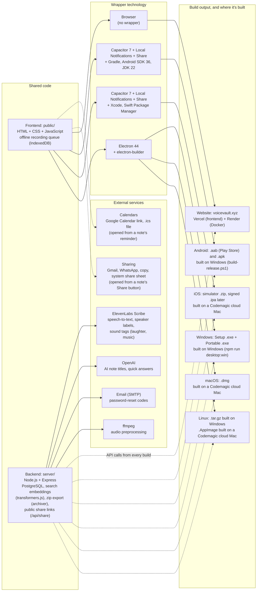

## 2026-10-07: share a note

- **Share button**: each note has a Share button (next to the transcript download, and in the open note's header). It opens a small window with three choices: **Transcript**, **Audio** or **Both**, and buttons to send it: **Copy**, **Gmail**, **WhatsApp**, and **More…** (the phone's or browser's own share menu, where available).
- **Transcript** sends the title and transcript as text. Gmail and WhatsApp take the text inside a link, so very long transcripts are shortened there (with a note to use Copy for the full text).
- **Audio** and **Both** send a private link to a simple page where anyone with the link can play or download the recording; Both also shows the transcript on that page and in the message. On a phone, More… can attach the audio file itself. Audio and Both are greyed out for notes without audio.
- **Stop sharing** (shown once a link exists) switches off every link for that note. Links also stop working when the note or the account is deleted.

## 2026-10-04: project moved, attempts and countdown on every limited screen

- **Project folder**: voiceVault now lives at `D:\Projects\voiceVault`, beside NoteVault (the old folder is kept as a backup). Tested from the new place; `docs/handover.txt` summarises where things are and what's left.
- **Attempts and countdown**: the reset-password screen (wrong emailed code) and the delete-account panel now behave like login. A wrong try says how many attempts are left; after the third, that message is replaced by a live "Try again in N s" countdown and the button is greyed out; then "You can try again now." appears and a new round of 3 starts. Sign up has no limit (there is nothing to guess).

## 2026-10-03: Newest label position, profile icon buttons

- **Newest label**: moved to its own line under the note's download, transcript and delete buttons, so it no longer covers the delete button.
- **Profile buttons**: Delete account, Export all notes and Edit profile are now one row of icon buttons (bin, download arrow, person with pencil). All three share the plain button background (the bin is tinted red). The delete confirmation (password, × to cancel and a red bin to delete permanently) opens below them. Edit Profile uses icons too: camera (change photo), × (cancel) and save. Each button keeps its name as a tooltip and for screen readers.

## 2026-10-02 (later): login limit, offline recording, reminders, export, search fix, tidy-up

- **Login limit**: after 3 wrong passwords for an email, login is blocked for 30 seconds, then a fresh round of 3 attempts starts. The error says how many attempts are left, and the login form counts down while blocked (HTTP 429 `too_many_attempts` with `retry_after`). The same limit covers the password-reset code and the delete-account password. The count is kept in server memory, so a restart clears it.
- **Record without internet**: with no connection, Save keeps the recording on the device (IndexedDB) and a banner shows how many are waiting. They upload and transcribe on their own when the connection returns (also checked every minute and at login). The app opens offline using the last signed-in user. On the website the page must already be open.
- **Reminders and calendar**: a note can have a reminder date and time (new note form and Edit mode; stored in `notes.reminder_at`). The note shows a reminder chip plus "Add to Google Calendar" and "Download .ics" (a 30-minute event with an alarm at the start). In the Android and iOS apps the phone shows a notification at that time (Capacitor Local Notifications). `GET /api/reminders` lists upcoming reminders.
- **Export all notes**: Profile has an "Export all notes" button beside Edit. It downloads one `.zip` with each note's transcript (`.txt`) and audio, named after the note title (`GET /api/export/notes.zip`, streamed).
- **"Eyes" search fix**: search highlighted the middle of the matching segment but cut off words at its edges (such as "eyes" at the end of "look into my eyes"). It now highlights the searched words themselves.
- **Newest label**: the most recently created note has a "Newest" label at the bottom right of its card ("Newest match" in search results). The order of notes is unchanged.
- **Titles from the background job**: speaker labels are also read from the transcript lines, so a job-processed note is titled "Look Into My Eyes - Speaker 1", not "Speaker 1 Look Into My Eyes".
- **Error text**: login and form errors are dark red on the light background (they were very faint pink).
- **Blueprint and folders**: the original blueprint is now `VoiceVault_blueprint.md` / `.docx`. Reports, `.docx` and `.txt` files moved to `docs/`, and screenshots and the chart image to `images/`.
- **Tested** on a local server: the 3-attempt lock and 30 s countdown, a reminder saved, listed and cleared, the export `.zip` (title-named `.txt` and `.wav`), the highlighted search words, the Newest label, and an offline save that uploaded when the connection came back.

## 2026-10-02: speaker labels, sound tags, account deletion, MP4 fallback

- **Speaker labels**: note transcription now asks ElevenLabs Scribe to tell speakers apart (`diarize`). Each line of the transcript starts with "Speaker 1:", "Speaker 2:" and so on, and each saved segment remembers its speaker (`segments_json` and the new `note_segments.speaker` column). Search queries and the live preview are not labelled.
- **Renaming speakers**: after "Full preview" a "Speakers" box lists each speaker with an editable name (for example "Speaker 1" to "David"); the transcript updates as you type. Saved notes have the same box in Edit mode, and the server renames the speaker everywhere in the note (`PATCH /api/notes/:id` with `speakers`). Names are limited to letters, digits, spaces, `'` and `-` (40 characters).
- **Titles**: automatic titles (AI or heuristic) are made from the transcript without speaker labels and sound tags, then list every detected speaker, for example "Project Deadline Plan - Speaker 1, Speaker 2". Renaming a speaker also renames it in the title, wherever the name appears (including older titles that start with "Speaker 1").
- **Sound tags**: Scribe also adds tags such as "(laughter)" or "(music)" to note transcripts (`tag_audio_events`). It doesn't name specific instruments.
- **Account deletion**: Profile has a "Delete account" section. After the password is confirmed, `POST /api/auth/delete-account` removes the account, all notes, drafts, folders, tags, saved searches, audio files and the profile picture, then signs out. Sessions on other devices stop working (the server checks the account still exists).
- **MP4 recording fallback**: browsers that can't record WebM/Opus (older iPhones and Safari) record MP4 (AAC) instead. The upload is named `.m4a`, and the server and audio download use the right extension.
- **Tested** on a local server: a two-voice recording came back as Speaker 1 and Speaker 2, a rename was saved, a wrong password was refused, and deleting the account removed all its data and ended its session.

## Session summary (2026-09-28 to 2026-10-01)

- **App sessions + CORS**: cross-site session cookies behind `VOICEVAULT_CROSS_SITE_COOKIES=1`; CORS allowlist covers the Android/desktop (`https://localhost`) and iOS (`capacitor://localhost`, `capacitor://app.voicevault.xyz`) app origins.
- **Faster first search**: embedder warm-up at server start, model baked into the Docker image, chunks embedded at transcription time. Confirmed fast for new and old notes.
- **iOS zoom fix**: 16px form fields on touch screens (iOS zoomed in on focus and never zoomed out).
- **Empty library message**: visible again (light background, dark text).
- **iOS login verified** on a Codemagic iPhone simulator over VNC after the `app.voicevault.xyz` origin change.
- **Reports**: technology and build map added (with ElevenLabs, OpenAI, email and ffmpeg as backend services); README brought up to date (PostgreSQL, ElevenLabs, live URLs, NoteVault apps).
- Earlier session (2026-05-07, UI refresh) is recorded in `Edits_made.md`.

## Technology and build map (2026-10-01)

The voiceVault website and the NoteVault apps share one frontend (`public/`) and one backend (`api.voicevault.xyz`). Each build wraps the same frontend with a different technology. The app wrappers (Capacitor, Electron) live in the NoteVault project (`D:\Projects\NoteVault`, GitHub `1218Anubhavmishra/NoteVault`). The backend calls **ElevenLabs Scribe** to turn recorded audio into text (word timestamps, language detection, who spoke each line, and sound tags such as laughter or music; `server/elevenlabs-stt-vv.js`, key `ELEVENLABS_API_KEY`). A local faster-whisper model is an optional alternative (`VOICEVAULT_STT_PROVIDER=whisper`). OpenAI generates note titles and quick answers when `OPENAI_API_KEY` is set, SMTP email sends password-reset codes, and ffmpeg prepares audio before transcription. Search embeddings run locally on the server (transformers.js), so search needs no external API.

