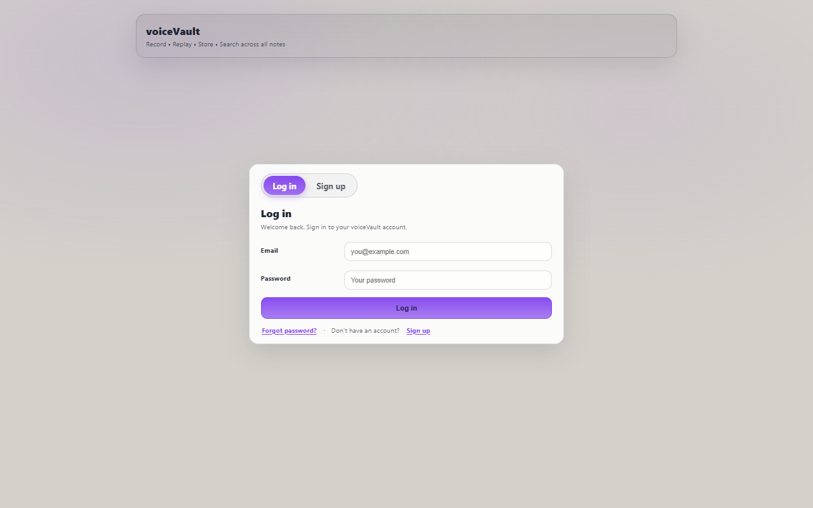
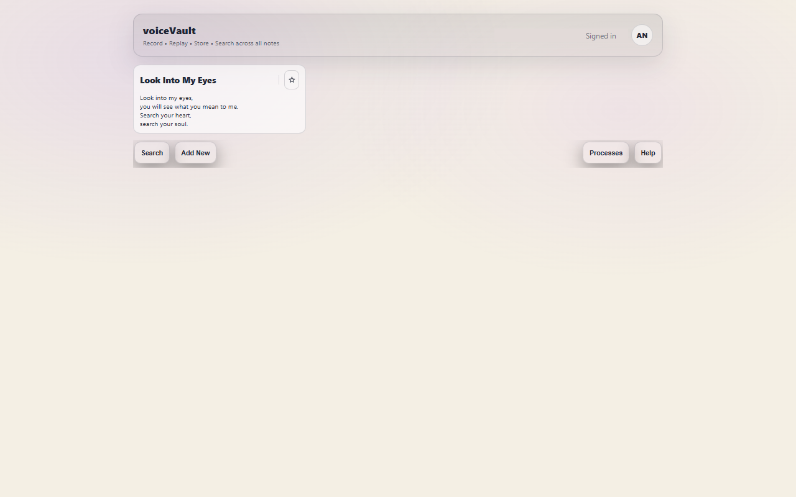
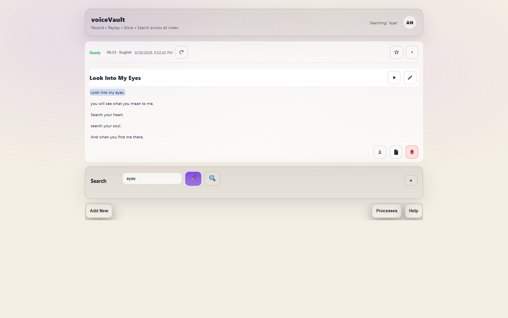
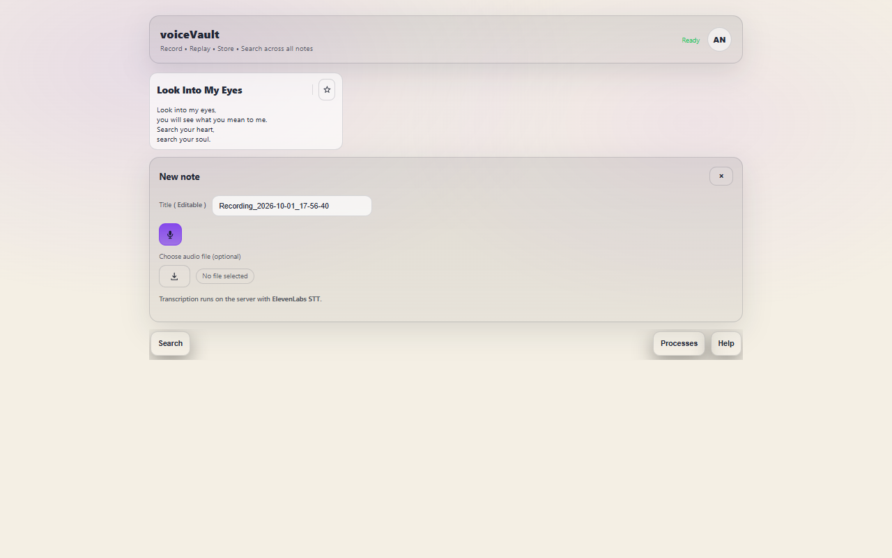
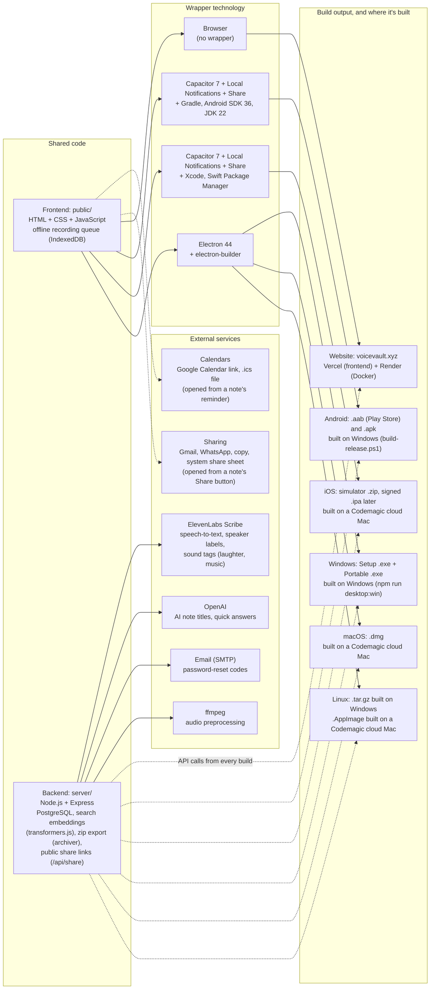

## 1) Executive summary

`voiceVault` is a **voice-first** notes product that lets you:

- **Capture** audio notes (record in the browser or upload a file).
- **Index** them by transcribing on the server with **ElevenLabs Scribe** (word timestamps, language detection), then splitting transcripts into searchable segments with embeddings.
- **Retrieve** notes by searching across transcripts, including **voice query** search (record a short query → transcribe → search).

It is live at [voicevault.xyz](https://www.voicevault.xyz): frontend on **Vercel**, API at `api.voicevault.xyz` on **Render** (Docker), data in **PostgreSQL**. The same frontend is packaged as the **NoteVault** apps for Android, iOS, Windows, macOS and Linux. Search is **hybrid**: PostgreSQL full-text matching blended with semantic retrieval over transcript segments.

## 1.1) Screenshots

Taken from the live site (voicevault.xyz, 1280×800) on 2026-10-01.









## 2) Scope (what it is / isn't)

- **Is**: A multi-user web app with accounts, server-side transcription, transcript search, audio playback/download, and native app builds of the same UI.
- **Is not (yet)**: Collaboration/sharing, automatic recognition of who a speaker is (speakers are labelled "Speaker 1", "Speaker 2" and named by hand), integrations (calendar, reminders), or offline use of the apps.

## 3) Product goals aligned to `VoiceVault_blueprint.md`

From `VoiceVault_blueprint.md`, the three pillars are Capture / Index / Retrieve.

- **Capture (implemented)**:
  - In-browser and in-app recording (microphone).
  - File upload (audio note ingestion).
  - UI timers and "processing" status.
- **Index (implemented, server-side)**:
  - Speech-to-text with ElevenLabs Scribe (local faster-whisper optional).
  - PostgreSQL persistence of notes, audio, transcripts and segments.
  - Background ingestion queue; segments are embedded before a note is marked ready.
  - Optional language selection + auto-detect.
- **Retrieve (implemented, hybrid)**:
  - Search by typing.
  - Search by speaking a query (audio query → speech-to-text → search).

## 4) Current feature set (implemented)

### Accounts

- Register, log in/out, profile name and picture.
- Forgot password: a reset code is emailed (SMTP).
- Each user only sees their own notes; sessions are cookie-based and work from the website and the apps.
- Delete account (Profile): after the password is confirmed, the account and all its notes, drafts, folders, tags, saved searches, audio and profile picture are removed. Sessions on other devices stop working.
- Login limit: after 3 wrong passwords, login is blocked for 30 seconds (the form counts down), then 3 more tries are allowed. The reset code and the delete-account password have the same limit.
- Export all notes (Profile, beside Edit): a `.zip` with each note's transcript (`.txt`) and audio, named after the note title.

### Notes

- **Create notes**
  - Record an audio note and save it.
  - Upload an existing audio file and save it as a note.
  - Recording uses WebM/Opus, or MP4/AAC on browsers without WebM (older iPhones, Safari).
  - Without internet, Save keeps the recording on the device; it uploads and transcribes when the connection returns.
- **Reminders and calendar**
  - A note can have a reminder date and time (when creating it or in Edit mode).
  - The note offers "Add to Google Calendar" and a downloadable `.ics` event; the Android and iOS apps show a phone notification at that time.
- **Share a note**
  - The Share button offers Transcript, Audio or Both, sent by Copy, Gmail, WhatsApp or More… (the device's share menu).
  - Transcript is sent as text; long transcripts are shortened in Gmail and WhatsApp messages (Copy keeps the full text).
  - Audio and Both send a private link to a page where anyone with the link can play or download the recording (Both adds the transcript). "Stop sharing" switches the links off; deleting the note or account does too.
- **Newest label**: the most recently created note is marked "Newest" at the bottom right of its card.
- **Speaker labels and sound tags**
  - Note transcripts start each line with the speaker ("Speaker 1:", "Speaker 2:") and include tags such as "(laughter)" or "(music)".
  - Speakers can be renamed in the "Speakers" box after Full preview, and in Edit mode on saved notes; the name changes everywhere in the note.
- **Background transcription**
  - On save, notes enter **`processing`** state and later become **`ready`** (or **`error`** on failure).
  - Optional AI-generated titles (OpenAI).
- **Timestamped segments**
  - Saved notes store **timestamped segments** (start/end seconds + text) alongside the transcript.
  - UI can play **only a selected segment** (not just full-audio playback).
- **Segment playback UX**
  - Segment rows highlight while playing.
  - Full-audio playback also highlights the currently active segment row while following along.
- **Playback & export**
  - Play note audio in the UI.
  - Download note audio (icon button near the inline player).
  - Download transcript text (icon in the expanded note header).
- **Edit & delete**
  - Edit transcript and title (and language metadata) after processing.
  - Delete a note.
  - Retry transcription for failed notes.
  - Star notes and pin them to the top of the saved-notes list.
- **Auto-sync**: the apps refresh the notes list when notes change elsewhere.

### Search

- **Full-text search (PostgreSQL `tsvector` + GIN index)** across title + body.
- **Voice query search** (record a short "search" audio query → transcribe → search).
- **Hybrid search (default)**
  - Keyword matching blended with embeddings-based retrieval over timestamped segments. The embedding model is preloaded when the server starts, so the first search is fast.
- **Natural-language query rewrite**
  - Queries like "find me the note where I talked about recording" are rewritten into keyword-style queries.
- **Date/time filters in search**
  - Supports filters like `today`, `yesterday`, `last 3 days`, `2026-04-22`, and `between 2026-04-20 and 2026-04-22`.
- **Best-match highlighting** (the searched words in the matching segment) and **multi-clip results** (several matching segments per note).
- **Quick answer**: extractive answer from top matching segments, or an OpenAI answer grounded in those segments when configured.

### UI layout (current)

- **Single stacked layout**: saved notes at the top, and panels (Search / Processes / Add New / Help) open beneath via quick actions.
- Panels are **mutually exclusive** (opening one closes the others).
- Saved notes use a **collapsed card** view by default; expanding shows a scrollable transcript with a **sticky title** and icon actions in the header.

## 5) Architecture and data flow

### Components

- **Frontend**: Static UI in `public/` (vanilla HTML/CSS/JS), deployed on Vercel and bundled into the NoteVault apps.
- **Backend**: Node.js + Express in `server/`, deployed on Render from the `Dockerfile`.
- **DB**: PostgreSQL via `pg` (`server/db.js`).
- **Transcription**: ElevenLabs Scribe over HTTPS (`server/elevenlabs-stt-vv.js`); optional local faster-whisper (`server/transcribe.py`). `ffmpeg` prepares audio.
- **Semantic search**: `Xenova/all-MiniLM-L6-v2` embeddings with transformers.js (`server/embeddings.js`, `server/semantic.js`).

### Storage

- **Notes, transcripts, segments, accounts**: PostgreSQL tables.
- **Audio**: PostgreSQL `BYTEA` column.
- **Search index**: generated `tsvector` column (keyword search) and per-segment embeddings (semantic search).

### Note creation flow (simplified)

1. The browser or app records or uploads audio.
2. Backend `POST /api/notes` stores the audio and inserts the note as `processing`.
3. The ingestion queue sends the audio to ElevenLabs (or local Whisper) for transcription.
4. The backend saves the transcript, language and segments, embeds the segments, and marks the note `ready`.

### Search flow (simplified)

- **Text search**: `GET /api/notes?q=...` runs PostgreSQL full-text search blended with semantic matches.
- **Voice search**: the UI records query audio → `POST /api/transcribe` → uses the returned transcript as the search string.

## 6) Tech stack

- **Node.js**: `>=20` (22 LTS recommended)
- **Backend**: Express, Multer (uploads), cookie sessions, bcrypt (passwords), Nodemailer (email)
- **Database**: PostgreSQL (`pg`)
- **Speech-to-text**: ElevenLabs Scribe (default), faster-whisper (optional, needs Python 3.10+)
- **Search**: PostgreSQL full-text search + transformers.js embeddings
- **AI (optional)**: OpenAI for titles and quick answers
- **Media**: `ffmpeg`
- **Hosting**: Vercel (frontend), Render (Docker API + PostgreSQL)

### Technology and build map

The voiceVault website and the NoteVault apps share one frontend (`public/`) and one backend (`api.voicevault.xyz`). Each build wraps the same frontend with a different technology. The app wrappers (Capacitor, Electron) live in the NoteVault project (`D:\Projects\NoteVault`, GitHub `1218Anubhavmishra/NoteVault`). The backend calls **ElevenLabs Scribe** to turn recorded audio into text (word timestamps, language detection, who spoke each line, and sound tags such as laughter or music; `server/elevenlabs-stt-vv.js`, key `ELEVENLABS_API_KEY`). A local faster-whisper model is an optional alternative (`VOICEVAULT_STT_PROVIDER=whisper`). OpenAI generates note titles and quick answers when `OPENAI_API_KEY` is set, SMTP email sends password-reset codes, and ffmpeg prepares audio before transcription. Search embeddings run locally on the server (transformers.js), so search needs no external API.



## 7) Configuration (env vars)

The full list with comments is in `.env.example`. The main ones:

- `DATABASE_URL`: PostgreSQL connection string (required; Internal URL on Render)
- `VOICEVAULT_STT_PROVIDER`: `elevenlabs` (recommended) or `whisper`
- `ELEVENLABS_API_KEY`: required for ElevenLabs transcription; `ELEVENLABS_STT_MODEL` optional (`scribe_v1` default)
- `OPENAI_API_KEY`: optional; enables AI titles and quick answers
- `VOICEVAULT_SESSION_SECRET`: keeps sessions valid across restarts
- `VOICEVAULT_CROSS_SITE_COOKIES=1`: production only; lets the apps stay logged in
- `VOICEVAULT_CORS_ORIGINS`: extra allowed origins (the app origins are built in)
- `EMAIL_*`: SMTP settings for password-reset codes
- `VOICEVAULT_MODEL_CACHE_DIR`: where the search model is cached (set in the Dockerfile)
- `PORT`: server port (default `5177`)

## 8) Local run & testing (Windows-focused)

### Prerequisites

- Node.js 22 LTS
- `ffmpeg` installed and on PATH
- A PostgreSQL database and an ElevenLabs API key
- Python 3.10+ only for local Whisper

### One-time setup

Copy `.env.example` to `.env` and fill in `DATABASE_URL` and `ELEVENLABS_API_KEY`. For local Whisper only:

```powershell
.\scripts\install-ffmpeg.ps1
.\scripts\setup-transcription.ps1
```

Then:

```bash
npm install
npm run dev
```

Open `http://localhost:5177`.

### Test plan (quick)

- **Sign up / log in / log out**, and a password reset by email.
- **Record → Save**: record 10–20 seconds, save; confirm note appears as `processing` then `ready`.
- **Playback**: play audio; confirm it matches recording.
- **Transcript**: confirm transcript is visible; edit it and verify it persists.
- **Search by text**: search for a phrase from transcript; confirm note appears and the first search is fast.
- **Search by voice**: record a short search query; confirm results match.
- **Delete**: delete a note; confirm it disappears.
- **Speakers**: upload a recording with two voices; confirm "Speaker 1" / "Speaker 2" labels, rename one and confirm it persists.
- **Delete account**: with a test account, delete it from Profile; confirm a wrong password is refused and the account can't log in afterwards.
- **Failure path**: use an invalid `ELEVENLABS_API_KEY`; confirm the note becomes `error`; fix the key and click retry.

## 9) Known constraints

- Semantic retrieval is **segment-level** (not word-level alignment) and uses brute-force similarity, fine for personal libraries but not for very large ones.
- Transcription depends on the ElevenLabs API (quota, availability); LLM answers are **optional** and need an OpenAI key.
- Speaker labels are generic ("Speaker 1"); the app doesn't recognise who is speaking. Sound tags are general (laughter, music) and don't name instruments.
- Recording uses WebM, with an MP4 fallback; neither is tested on a physical iPhone yet.
- Offline recording on the website only works if the page is already open; the apps need one earlier online login.
- Reminder notifications only appear in the Android and iOS apps and may arrive a few minutes late; the website and desktop apps offer the calendar link and `.ics` instead.
- The login limit is kept in server memory, so a server restart clears it.

## 10) Cross-check vs original documents (what's still missing)

This section cross-checks the current product against the "semantic search / voice Q&A" blueprint in `VoiceVault_blueprint.md` and the baseline goals described in `report1.md`.

### Missing relative to `VoiceVault_blueprint.md` (blueprint)

- **Semantic retrieval (mostly addressed)**:
  - Embeddings-based retrieval over segments exists.
  - Missing: vector DB / ANN indexing for large scale, and a richer reranking pipeline.
- **Grounded Q&A (partially addressed)**:
  - Optional LLM answering exists and is grounded in retrieved clips with citations.
  - Missing: stronger safety/guardrails, evals, and long-context scaling.
- **Timestamp-level results (mostly addressed)**:
  - Timestamped segments with word timings from ElevenLabs; segment-level "jump and play"; multiple clips per note.
  - Still missing: word-level jump targets in search results.
- **Chunking pipeline (partially addressed)**:
  - Transcripts are split into segment chunks with embeddings; no topic-based segmentation yet.
  - Speaker diarization (who spoke each line) is done for note transcripts, with renameable speaker names.
- **Mobile-first product (addressed)**:
  - Android and iOS apps (Capacitor) plus Windows/macOS/Linux desktop apps (Electron) in the NoteVault project.
- **Cloud components (addressed)**:
  - PostgreSQL, accounts with password reset, background ingestion queue, hosted API. Audio is stored in the database rather than object storage (S3).
- **Product surfaces**:
  - Note reminders exist (calendar link, `.ics`, phone notifications in the apps). No two-way calendar sync, contacts, collaboration, or ambient mode.

### Items from `report1.md` (baseline) that are covered

- In-browser recording + upload
- Server transcription + PostgreSQL persistence
- Audio query search
- Segment-level playback from transcript timestamps

### `VoiceVault_blueprint.docx`

`VoiceVault_blueprint.docx` contains the same blueprint/requirements described in `VoiceVault_blueprint.md` (capture → transcribe/index → semantic retrieval → grounded answers + timestamped clips). The "missing" items above therefore apply equally to `VoiceVault_blueprint.docx`.
