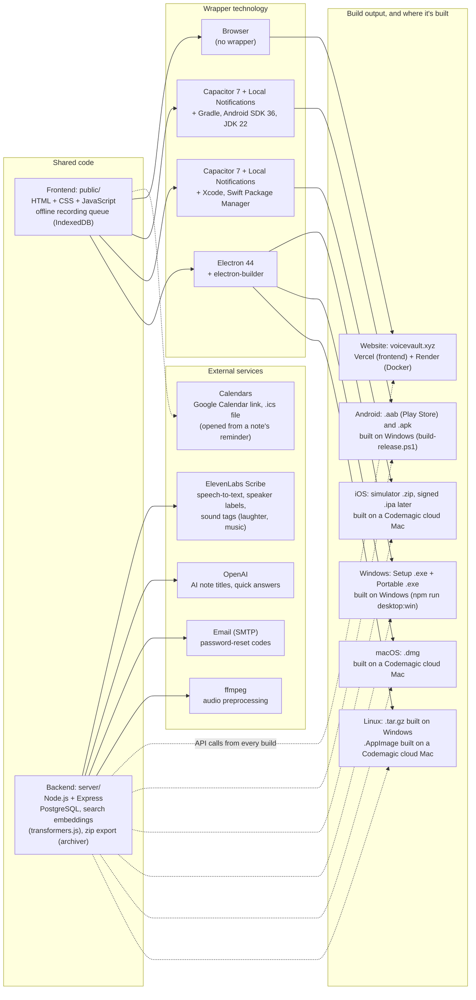

# voiceVault — Project Report

## Overview
`voiceVault` is an audio note app: users **record or upload audio notes**, the server **transcribes** them, and users **search across all notes** by text or voice. It is live at [voicevault.xyz](https://www.voicevault.xyz) (frontend on Vercel, API `api.voicevault.xyz` on Render, PostgreSQL). The same frontend ships as Android, iOS, Windows, macOS and Linux apps under the name NoteVault.

## Core Features
- **Accounts**: register, log in, profile picture, password reset by emailed code, and account deletion (password required; removes all notes and audio); each user sees only their own notes. After 3 wrong passwords, login waits 30 seconds (with a countdown) before the next 3 tries.
- **Record without internet**: recordings saved offline wait on the device and upload when the connection returns.
- **Reminders**: a note can have a reminder date and time, with "Add to Google Calendar" and an `.ics` file; the Android and iOS apps also show a phone notification.
- **Export all notes**: one `.zip` with every note's transcript and audio, named after the note titles (Profile, beside Edit).
- **Newest label**: the most recent note is marked "Newest" at the bottom right of its card.
- **In-browser recording**: Uses the browser `MediaRecorder` API to capture audio (WebM/Opus, or MP4/AAC where WebM isn't supported), or upload an audio file.
- **Server transcription**: **ElevenLabs Scribe** turns audio into text with word timestamps and language detection (local faster-whisper is an optional alternative).
- **Speaker labels and sound tags**: note transcripts mark who spoke each line ("Speaker 1:", "Speaker 2:") and add tags such as "(laughter)" or "(music)". Speakers can be renamed before saving and later in Edit mode.
- **Optional AI titles and quick answers** with OpenAI.
- **Timestamped segments**: Saved notes include segment timestamps for clip-style playback.
- **Audio-based search**: Records a short audio query, transcribes it, then searches across stored note transcripts.
- **Natural-language + time-filter search**: Supports queries like “find the note about X yesterday” or `between 2026-04-20 and 2026-04-22`.
- **Semantic search (embeddings computed on the server)**: retrieval over timestamped segments; the model is preloaded so the first search is fast.
- **Hybrid search (default)**: Keyword matching blended with local embeddings retrieval over timestamped segments.
- **UI windows**: The left column includes **New note**, **Processes**, and **Help**. Opening any left window restores a 50/50 split; collapsing makes Search wider. Processes stays hidden unless there are failures (auto-opens on error).
- **Help controls layout**: Opening **App hint** / **UI steps** triggers the 50/50 split (no separate Help Show/Hide button).
- **Mutual exclusivity**: Only one of the three windows can be open at a time (opening one closes the other two). On load, all three start collapsed by default; if any note is in **error**, **Processes** auto-opens.

## Tech Stack
- **Backend**: Node.js (Express), deployed as a Docker image on Render
- **Database**: PostgreSQL (`pg`); keyword search uses a `tsvector` column with a GIN index
- **Uploads**: `multer`
- **Frontend**: Static HTML/CSS/JavaScript in `public/`, deployed on Vercel
- **Transcription**: ElevenLabs Scribe (default) or local faster-whisper; `ffmpeg` for audio preprocessing
- **Semantic search**: `Xenova/all-MiniLM-L6-v2` embeddings via transformers.js, run on the server
- **Other services**: OpenAI (optional titles/answers), SMTP email (password reset)

### Technology and build map

The voiceVault website and the NoteVault apps share one frontend (`public/`) and one backend (`api.voicevault.xyz`). Each build wraps the same frontend with a different technology. The app wrappers (Capacitor, Electron) live in the NoteVault project (`D:\Projects\NoteVault`, GitHub `1218Anubhavmishra/NoteVault`). The backend calls **ElevenLabs Scribe** to turn recorded audio into text (word timestamps, language detection, who spoke each line, and sound tags such as laughter or music; `server/elevenlabs-stt-vv.js`, key `ELEVENLABS_API_KEY`). A local faster-whisper model is an optional alternative (`VOICEVAULT_STT_PROVIDER=whisper`). OpenAI generates note titles and quick answers when `OPENAI_API_KEY` is set, SMTP email sends password-reset codes, and ffmpeg prepares audio before transcription. Search embeddings run locally on the server (transformers.js), so search needs no external API.



## Repository Structure (high-level)
- `server/`: Node backend (API, auth, PostgreSQL access, ElevenLabs/Whisper transcription, semantic search)
- `public/`: Browser UI (recording + search)
- `docs/`: reports, `.docx` copies, the original blueprint (`VoiceVault_blueprint.md`) and notes
- `images/`: screenshots and the technology chart image
- `scripts/`: Setup and maintenance helpers (ffmpeg, optional Whisper setup, SQLite-to-PostgreSQL migration)
- `Dockerfile`: the image Render runs (includes ffmpeg and the preloaded search model)

## Local Setup & Run Instructions (Windows)
### Prerequisites
- **Node.js**: 22 LTS recommended
- **ffmpeg**: installed and on PATH
- **PostgreSQL** database, plus an ElevenLabs API key
- Python 3.10+ only if you use local Whisper instead of ElevenLabs

### One-time setup
Copy `.env.example` to `.env` and set at least `DATABASE_URL` and `ELEVENLABS_API_KEY`. For local Whisper only:

```powershell
.\scripts\install-ffmpeg.ps1
.\scripts\setup-transcription.ps1
```

### Install Node dependencies
```bash
npm install
```

### Start the app
```bash
npm run dev
```

Then open:
- `http://localhost:5177`

## Key NPM Scripts
- **dev**: `node server/index.js`
- **start**: `node server/index.js`

## Data & Persistence
- Notes, transcripts, audio (BYTEA), search chunks and accounts are stored in PostgreSQL.
- `.env`, API keys and local `data/` scratch files are **ignored by git**.

## Deployment / Distribution Notes
- **Website**: GitHub `1218Anubhavmishra/voiceVault` → Vercel (frontend) and Render (Docker API + PostgreSQL).
- **Apps**: the NoteVault project wraps the same `public/` frontend for Android/iOS (Capacitor) and Windows/macOS/Linux (Electron); all of them call `api.voicevault.xyz`.
- The apps rely on `VOICEVAULT_CROSS_SITE_COOKIES=1` and the server's CORS allowlist to stay logged in.

## Risks / Constraints
- Transcription depends on the ElevenLabs API (key, quota, availability); local Whisper needs Python and more CPU.
- Browser recording requires microphone permissions; recording uses WebM, with an MP4 fallback for browsers without WebM (older iPhones); neither is tested on a physical iPhone yet.
- Segment playback for MP3 relies on browser seeking support; the server supports HTTP byte ranges for accurate seeking.

