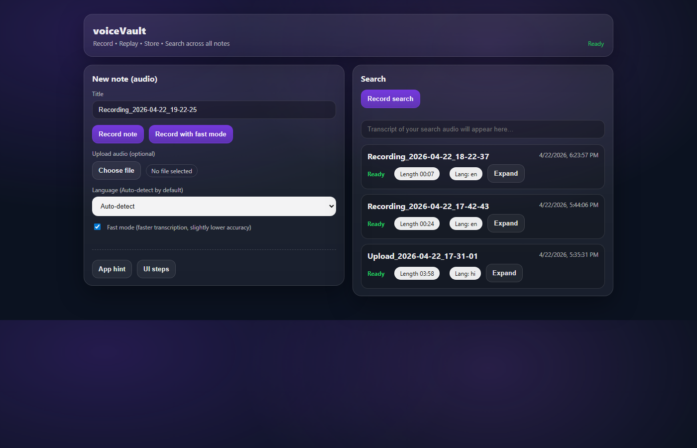

## 1) Executive summary

`voiceVault` is a **local-first, voice-first** web prototype that lets you:

- **Capture** audio notes in the browser (record or upload).
- **Index** them locally by transcribing audio **offline** using Whisper via `faster-whisper`.
- **Retrieve** notes by searching across transcripts, including **voice query** search (record a short query → transcribe offline → search).

This prototype focuses on delivering the core “voice in → searchable knowledge out” loop described in `VoiceVault.md`, but implements **full‑text search (SQLite FTS5)** rather than vector/semantic search.

## 1.1) Screenshots



## 2) Scope of this prototype (what it is / isn’t)

- **Is**: A working local web app that records audio, stores it on disk, transcribes offline, and supports transcript search + audio playback/download.
- **Is not**: A mobile app, cloud service, or multi-user product; does not include authentication, embeddings/vector DB, or LLM-based Q&A synthesis.

## 3) Product goals aligned to `VoiceVault.md`

From `VoiceVault.md`, the three pillars are Capture / Index / Retrieve.

- **Capture (implemented)**:
  - In-browser recording (microphone).
  - File upload (audio note ingestion).
  - UI timers and “processing” status.
- **Index (implemented, local)**:
  - Offline STT using Whisper (`faster-whisper`).
  - Local SQLite persistence of metadata + transcript.
  - Background/asynchronous transcription after note creation.
  - Optional language selection + auto-detect (depending on flow).
- **Retrieve (implemented, full-text)**:
  - Search by typing.
  - Search by speaking a query (audio query → offline STT → search).

## 4) Current feature set (implemented)

### Notes

- **Create notes**
  - Record an audio note in-browser and save it.
  - Upload an existing audio file and save it as a note.
- **Background transcription**
  - On save, notes enter **`processing`** state and later become **`ready`** (or **`error`** on failure).
- **Playback & export**
  - Play note audio in the UI.
  - Download note audio.
  - Download transcript text.
- **Edit & delete**
  - Edit transcript and title (and language metadata) after processing.
  - Delete a note (removes DB row and associated audio file).
  - Retry transcription for failed notes.

### Search

- **Full-text search (SQLite FTS5)** across title + body.
- **Voice query search** (record a short “search” audio query → transcribe offline → search).
- **Robustness improvements**:
  - FTS query normalization to avoid punctuation/operator errors.
  - Fallback to safe substring search when FTS throws.

### Language + models

- **Language selection**: UI can request a specific language code, or allow auto-detect (depending on endpoint).
- **Fast mode vs quality mode**:
  - “Fast mode” uses `tiny` by default.
  - “Quality mode” uses `medium` by default.
  - Both are configurable via env vars (see below).

## 5) Architecture and data flow

### Components

- **Frontend**: Static UI in `public/` (vanilla HTML/CSS/JS).
- **Backend**: Node.js + Express in `server/`.
- **DB**: SQLite via `better-sqlite3`.
- **Transcription**: Python (`server/transcribe.py`) using `faster-whisper`; requires `ffmpeg` on PATH.

### Storage (local-first)

- **Audio files**: `data/audio/<noteId>.<ext>`
- **Database**: `data/voicevault.sqlite`

These are intentionally local runtime artifacts (not meant to be committed).

### Note creation flow (simplified)

1. Browser records or uploads audio.
2. Backend `POST /api/notes` stores audio on disk and inserts a DB row as `processing`.
3. Backend runs offline transcription asynchronously (Python).
4. Backend updates DB row with transcript, detected/selected language, and final status.

### Search flow (simplified)

- **Text search**: `GET /api/notes?q=...` runs FTS5 (or safe LIKE fallback).
- **Voice search**: UI records query audio → `POST /api/transcribe` → uses returned transcript as the search string.

## 6) Tech stack

- **Node.js**: `>=20` (see `package.json`)
- **Backend**: Express, Multer (uploads)
- **SQLite**: `better-sqlite3`
- **Python**: 3.10+
- **Offline STT**: `faster-whisper`
- **Media**: `ffmpeg` on PATH

## 7) Configuration (env vars)

The server supports these environment variables:

- `PORT`: server port (default `5177`)
- `WHISPER_MODEL`: main/quality model (default: `medium`)
- `WHISPER_FAST_MODEL`: fast model (default: `tiny`)
- `WHISPER_LANG_MODEL`: model for language detection/live preview (default: `tiny`)
- `WHISPER_LANGUAGE`: default language override (empty = auto where supported)
- `VOICEVAULT_VAD`: `1` to enable VAD filtering; default is off (`0`)

## 8) Local run & testing (Windows-focused)

### Prerequisites

- Node.js 20+
- Python 3.10+
- `ffmpeg` installed and on PATH

### One-time setup

Run from project root:

```powershell
.\scripts\install-ffmpeg.ps1
.\scripts\setup-transcription.ps1
```

Then:

```bash
npm install
npm run dev
```

Open `http://localhost:5177`.

### Test plan (quick)

- **Record → Save**: record 10–20 seconds, save; confirm note appears as `processing` then `ready`.
- **Playback**: play audio; confirm it matches recording.
- **Transcript**: confirm transcript is visible; edit it and verify it persists.
- **Search by text**: search for a phrase from transcript; confirm note appears.
- **Search by voice**: record a short search query; confirm results match.
- **Delete**: delete a note; confirm it disappears and audio is removed.
- **Failure path**: break Python/ffmpeg temporarily; confirm note becomes `error`; then fix deps and click retry.

## 9) Known constraints (current prototype)

- **No semantic/vector search** (only FTS text search).
- **No timestamped clip retrieval** (search returns notes, not time offsets inside audio).
- **Single-user local app** (no auth, no cloud sync).
- **CPU-only transcription** by default; long notes can take time and can be hardware dependent.
- **No diarization / speaker labels**.

## 10) Cross-check vs original documents (what’s still missing)

This section cross-checks the current prototype against the “semantic search / voice Q&A” blueprint in `VoiceVault.md` and the baseline goals described in `report1.md`.

### Missing relative to `VoiceVault.md` (blueprint)

- **Semantic retrieval**:
  - No embeddings, no vector DB (pgvector/Pinecone/Weaviate), no ANN search.
  - No reranking pipeline (top‑k retrieval + rerank).
- **Grounded Q&A**:
  - No LLM answer synthesis (“when is X’s birthday?” style direct answers).
  - No citations into retrieved chunks.
- **Timestamp-level results**:
  - No chunk index with `timestamp` metadata.
  - No “jump to exact timestamp” playback.
- **Chunking pipeline**:
  - No semantic chunking (100–200 token chunks) or pause/topic segmentation stored as searchable units.
- **Mobile-first product**:
  - Prototype is a local web app, not React Native/Flutter iOS/Android.
- **Cloud components**:
  - No ingestion service queue, blob storage (S3), Postgres, auth (Supabase/Firebase), etc.
- **Product surfaces**:
  - No proactive reminders, integrations (calendar/reminders/contacts), collaboration, or ambient mode.

### Items from `report1.md` (baseline) that are covered

- In-browser recording + upload
- Local storage (`data/`)
- Offline transcription + SQLite persistence
- Audio query search

### `VoiceVault.docx`

`VoiceVault.docx` is present in the repo and its extracted content matches the same blueprint/requirements described in `VoiceVault.md` (capture → transcribe/index → semantic retrieval → grounded answers + timestamped clips). The “missing” items above therefore apply equally to `VoiceVault.docx`.

