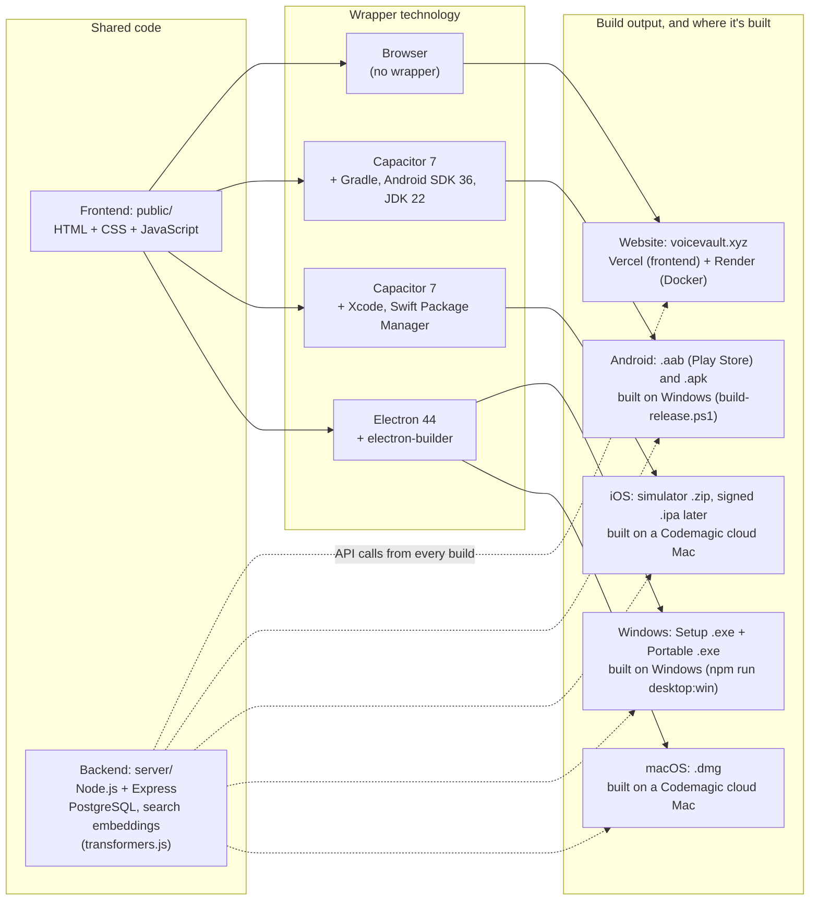

# voiceVault — Project Report

## Overview
`voiceVault` is a local-first audio note app that lets users **record audio notes**, **store them locally**, and **search across notes** using transcription and offline speech-to-text.

## Core Features
- **In-browser recording**: Uses the browser `MediaRecorder` API to capture audio.
- **Local storage**: Uploads and stores audio files on disk.
- **Offline transcription**: Uses **faster-whisper** (Python) to generate transcripts offline and stores them in SQLite.
- **Timestamped segments**: Saved notes include segment timestamps for clip-style playback.
- **Audio-based search**: Records a short audio query, transcribes it offline, then searches across stored note transcripts.
- **Natural-language + time-filter search (offline)**: Supports queries like “find the note about X yesterday” or `between 2026-04-20 and 2026-04-22`.
- **Semantic search (local embeddings)**: Optional embeddings-based retrieval over timestamped segments.
- **Hybrid search (default)**: Keyword matching blended with local embeddings retrieval over timestamped segments.
- **UI windows**: The left column includes **New note**, **Processes**, and **Help**. Opening any left window restores a 50/50 split; collapsing makes Search wider. Processes stays hidden unless there are failures (auto-opens on error).
- **Help controls layout**: Opening **App hint** / **UI steps** triggers the 50/50 split (no separate Help Show/Hide button).
- **Mutual exclusivity**: Only one of the three windows can be open at a time (opening one closes the other two). On load, all three start collapsed by default; if any note is in **error**, **Processes** auto-opens.

## Tech Stack
- **Backend**: Node.js (Express)
- **Database**: SQLite (via `better-sqlite3`)
- **Uploads**: `multer`
- **Frontend**: Static assets served from `public/` (app runs via Node server)
- **Transcription**: Python 3.10+ with `faster-whisper==1.1.1`, plus `ffmpeg` available on PATH

### Technology and build map

The voiceVault website and the NoteVault apps share one frontend (`public/`) and one backend (`api.voicevault.xyz`). Each build wraps the same frontend with a different technology. The app wrappers (Capacitor, Electron) live in the NoteVault project (`D:\Projects\NoteVault`, GitHub `1218Anubhavmishra/NoteVault`).



## Repository Structure (high-level)
- `server/`: Node backend + transcription integration
- `public/`: Browser UI (recording + search)
- `scripts/`: Setup helpers (ffmpeg + transcription setup, GitHub publish script)
- `data/` (runtime, ignored by git):
  - `data/audio/`: stored audio files
  - `data/voicevault.sqlite`: SQLite database

## Local Setup & Run Instructions (Windows)
### Prerequisites
- **Node.js**: 18+
- **Python**: 3.10+
- **ffmpeg**: installed and on PATH

### One-time setup
Run from the project root:

```powershell
.\scripts\install-ffmpeg.ps1
.\scripts\setup-transcription.ps1
```

### Install Node dependencies
```bash
npm install
```

### Start the app
```bash
npm run dev
```

Then open:
- `http://localhost:5177`

## Key NPM Scripts
- **dev**: `node server/index.js`
- **start**: `node server/index.js`

## Data & Persistence
- Audio and SQLite data are stored locally under `data/`.
- These runtime artifacts are intentionally **ignored by git** to avoid committing large/binary files and local DB state.

## Deployment / Distribution Notes
This project is designed for **local execution**. For sharing:
- Push the source to GitHub (public repo is supported).
- Users run locally after installing prerequisites (Node/Python/ffmpeg).

## Risks / Constraints
- **Offline transcription** requires a working Python environment and `ffmpeg`.
- Transcription performance depends on hardware and audio length.
- Browser recording requires microphone permissions.
- Segment playback for MP3 relies on browser seeking support; the server supports HTTP byte ranges for accurate seeking.
- Semantic search may take longer on first use (embeddings computed lazily and then cached in SQLite).

